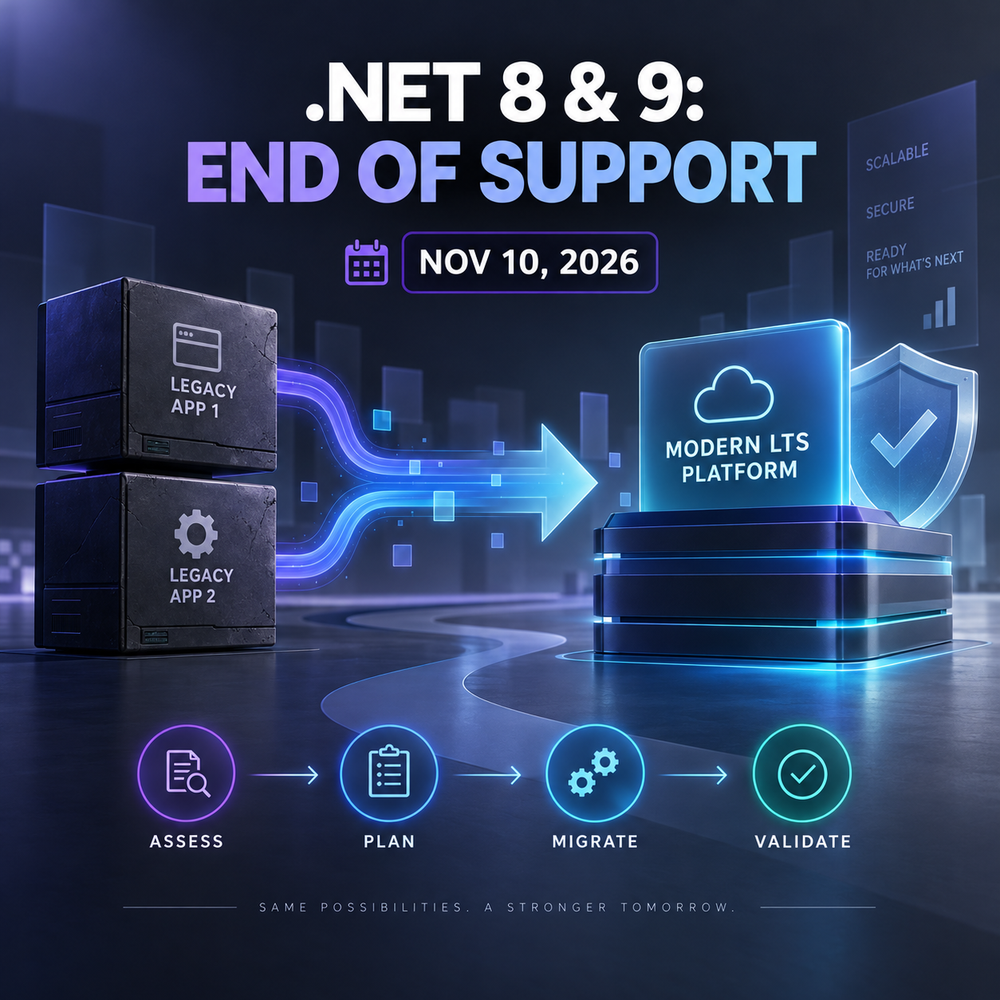

<!-- Origem: inventário do publicador Mac, 24/09/2026. Estado: published_confirmed. -->
<!-- Para publicar: revalidar fonte, perfil e agendados; preservar C2PA da capa original. -->

As dez rotinas foram recriadas com a regra obrigatória de conteúdo integralmente em inglês, inclusive todo texto incorporado nas imagens. Nenhuma publicação foi realizada.

### LinkedIn post

⚠️ Is your application still running on .NET 8 or .NET 9? Now is the time to plan the migration.

According to Microsoft’s official lifecycle, both versions will reach end of support on **November 10, 2026**.

After that date, applications running on these versions will no longer receive official fixes, including security updates.

The key point is simple: a runtime migration should not begin during the final week before the deadline.

A responsible migration plan should include:

✅ Inventorying applications, SDKs, and production runtimes  
✅ Identifying incompatible or abandoned dependencies  
✅ Planning a progressive migration to .NET 10 LTS  
✅ Running automated, regression, and performance tests  
✅ Validating container images and deployment pipelines  
✅ Establishing rollback and post-migration observability strategies

.NET 10 is a Long Term Support release, with support scheduled through November 2028. For teams maintaining applications on .NET 8 or .NET 9, it is the most natural migration target—but the decision must still account for dependencies, infrastructure, and each product’s delivery cycle.

Successful modernization is not just about changing the target framework in a project file. It is about reducing technical risk without disrupting the business.

Has your team already mapped which systems need to be upgraded?

#DotNet #CSharp #SoftwareArchitecture #Modernization #SoftwareEngineering

### Official sources

- [.NET support policy and lifecycle](https://dotnet.microsoft.com/en-us/platform/support/policy/dotnet-core)
- [Official .NET release notes](https://github.com/dotnet/core/blob/main/release-notes/README.md)
- [Official dotnet/core releases](https://github.com/dotnet/core/releases)

### New image

[Download the English PNG image](/Users/leandrojacome/.codex/generated_images/01a0d034-582a-72a1-98df-2af1c7150aba/exec-5a659f5a-b73e-49d1-b2d3-dd97992b6138.png)

The post remains unpublished. I need your explicit approval immediately before sending this exact text and image to LinkedIn.
