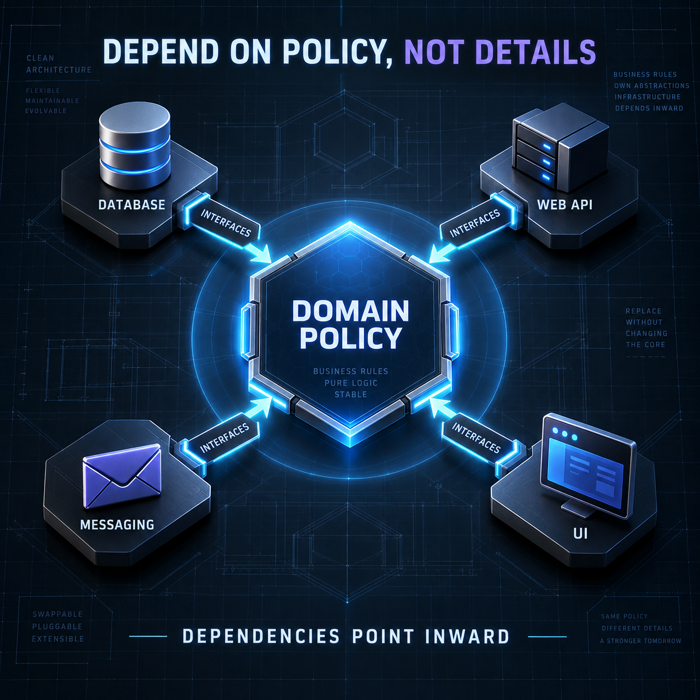

<!-- Origem: inventário do publicador Mac, 24/09/2026. Estado: prepared_unverified_schedule. -->
<!-- Para publicar: revalidar fonte, perfil e agendados; preservar C2PA da capa original. -->

The 8:00 PM architecture slot is ready as evergreen technical content.

**LinkedIn post**

Architecture becomes valuable when business rules survive infrastructure changes.

The Dependency Inversion Principle is often reduced to “use interfaces” or “add a dependency injection framework.” That misses the architectural point.

DIP is about the direction of ownership:

- Business policy defines the abstractions it needs.
- Databases, APIs, messaging systems, and user interfaces implement those abstractions.
- Dependencies point toward the domain—not toward infrastructure details.

This changes the way systems evolve.

When the domain directly depends on an ORM, message broker, or web framework, replacing that technology can force business logic to change. When infrastructure depends on contracts owned by the application core, those details become replaceable adapters.

A practical test for your architecture:

1. Can you test business rules without starting a database or HTTP server?
2. Could you replace the persistence mechanism without rewriting the domain?
3. Are infrastructure types leaking into use cases?
4. Does the composition root contain the wiring while the domain remains unaware of it?

Dependency injection can support this design, but it does not create it automatically. A codebase can use a DI container extensively and still have every dependency pointing in the wrong direction.

Good architecture does not eliminate dependencies. It makes their direction intentional.

Which infrastructure detail would be hardest to replace in your current system?

**Sources**

- [Microsoft Learn — Common web application architectures](https://learn.microsoft.com/en-us/dotnet/architecture/modern-web-apps-azure/common-web-application-architectures)
- [Martin Fowler — Inversion of Control Containers and Dependency Injection](https://martinfowler.com/articles/injection.html)
- [Martin Fowler — Refactoring Module Dependencies](https://martinfowler.com/articles/refactoring-dependencies.html)
- [Martin Fowler — DIP in the Wild](https://martinfowler.com/articles/dipInTheWild.html)

#SoftwareArchitecture #SOLID #CleanArchitecture #DependencyInversion #SoftwareEngineering

**Original English image**

[Download the PNG image](/Users/leandrojacome/.codex/generated_images/01a0d034-582a-72a1-98df-2af1c7150aba/exec-636852c7-1164-4207-9abb-1ef9f2fbbc95.png)

Nothing has been published. Explicit approval is required immediately before publishing this post and image to LinkedIn.

<heartbeat>
  <automation_id>calend-rio-editorial-linkedin</automation_id>
  <decision>NOTIFY</decision>
  <message>The 8:00 PM software architecture post and original English image are ready for review and explicit publishing approval.</message>
</heartbeat>
