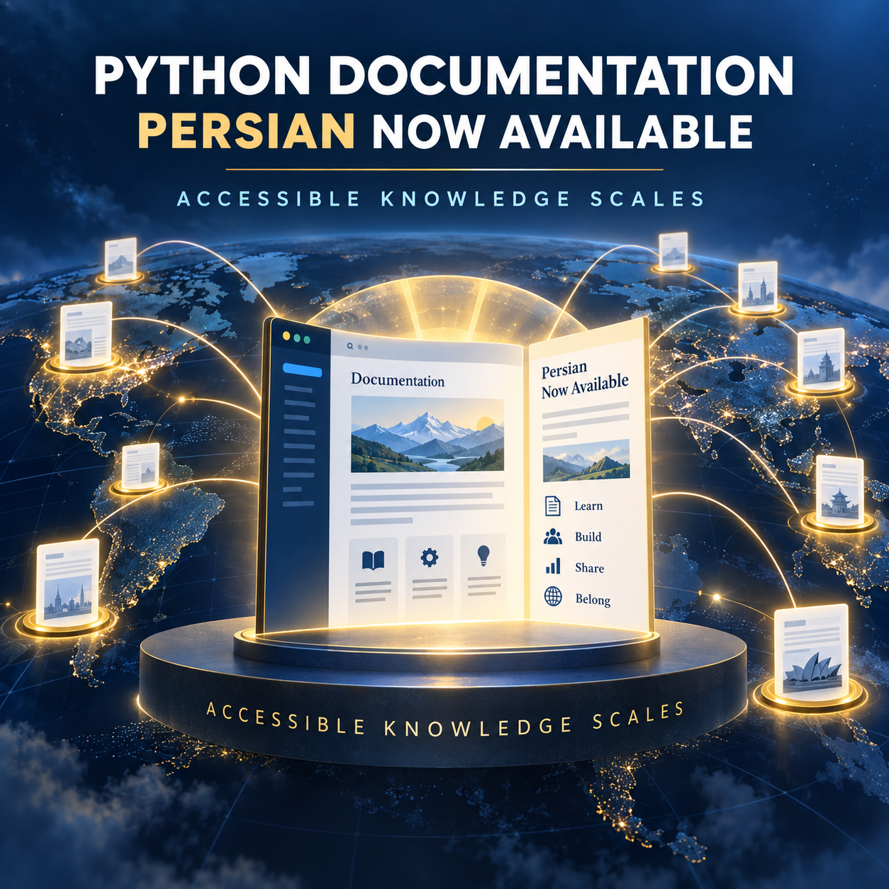

<!-- Origem: inventário do publicador Mac, 24/09/2026. Estado: prepared_unverified_schedule. -->
<!-- Para publicar: revalidar fonte, perfil e agendados; preservar C2PA da capa original. -->

The 10:00 PM Python package is ready. The official announcement is dated September 23, 2026; the source does not expose a publication time, so the post avoids claiming a more precise 12-hour window.

**LinkedIn post**

Python just became more accessible to millions of potential developers.

The Python core team has announced that the official Python documentation is now available in Persian.

This may look like a documentation update, but it represents something much larger: localization is part of developer infrastructure.

High-quality translated documentation can:

- Lower the barrier to learning a programming language
- Help developers understand technical concepts in their strongest language
- Expand participation in open-source communities
- Improve the accuracy of local training and educational material
- Create new paths for contributors who are not working directly on runtime code

Documentation localization is also a real engineering challenge. Persian uses a right-to-left writing system, and letters can change form depending on their position within a word. Supporting it properly requires attention to layout, navigation, typography, code samples, and long-term maintenance—not merely translating strings.

The Python community’s translation work demonstrates an important open-source principle: contribution is not limited to writing code.

Documentation, translation, review, accessibility, and community support all help a technology ecosystem scale.

The official announcement also invites contributors to help maintain existing translations and bring Python documentation to more languages.

Accessible knowledge creates accessible technology.

What technical resource made the biggest difference when you were learning to program?

**Sources**

- [Python Insider — The Python documentation is now available in Persian](https://blog.python.org/2026/09/the-python-documentation-is-now-available-in-persian/)
- [Python Developer’s Guide — Translating the Python documentation](https://devguide.python.org/documentation/translations/)
- [Python documentation translation dashboard](https://translations.python.org/)
- [W3C — Arabic and Persian layout requirements](https://www.w3.org/TR/alreq/)

#Python #OpenSource #DeveloperEducation #TechnicalDocumentation #Accessibility

**Original English image**

[Download the PNG image](/Users/leandrojacome/.codex/generated_images/01a0d034-582a-72a1-98df-2af1c7150aba/exec-afd4656b-bf23-434c-bab4-8c12818ecfe2.png)

Nothing has been published. Explicit approval is required immediately before publishing this post and image to LinkedIn.

<heartbeat>
  <automation_id>calend-rio-editorial-linkedin</automation_id>
  <decision>NOTIFY</decision>
  <message>The 10:00 PM Python post and original English image are ready for review and explicit publishing approval.</message>
</heartbeat>
