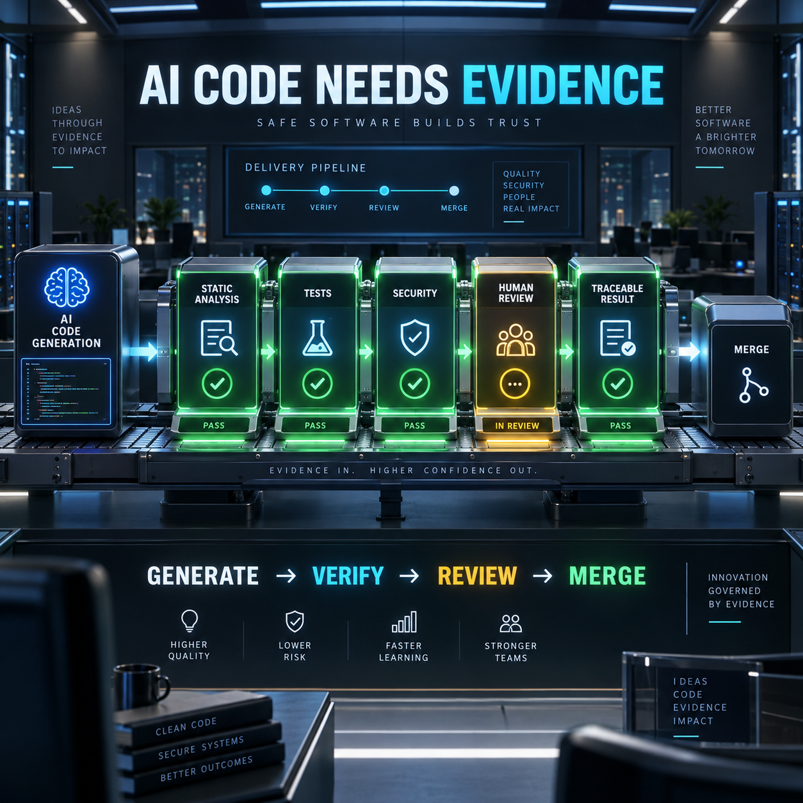

<!-- Origem: inventário do publicador Mac, 24/09/2026. Estado: prepared_unverified_schedule. -->
<!-- Para publicar: revalidar fonte, perfil e agendados; preservar C2PA da capa original. -->

The midnight AI-assisted development workflow package is ready as evergreen technical content.

**LinkedIn post**

AI-generated code should enter your delivery pipeline as a hypothesis—not as trusted output.

The speed of AI-assisted development changes how quickly teams can produce code. It does not remove the need to prove that the code is correct, secure, maintainable, and aligned with the intended behavior.

A reliable workflow separates generation from verification:

**1. Generate a bounded change**

Give the AI a precise objective, relevant repository context, acceptance criteria, and explicit constraints. Smaller changes are easier to understand and validate.

**2. Run deterministic checks**

The same gates applied to human-written code should apply to AI-generated code:

- Formatting and linting
- Compilation and type checking
- Unit and integration tests
- Security and dependency scanning
- Coverage and contract validation

**3. Review the reasoning surface**

A passing build does not prove that the implementation matches the business requirement. Review the changed behavior, assumptions, failure modes, and architectural impact.

**4. Preserve traceable evidence**

Keep the requirement, diff, test results, review findings, and deployment outcome connected. This makes failures easier to diagnose and successful patterns easier to reproduce.

**5. Require human accountability**

AI review can add useful feedback, but GitHub explicitly warns that automated review may miss problems and should be validated carefully alongside human review.

The goal is not to slow AI down. It is to convert speed into dependable delivery.

A useful operating principle:

**AI proposes. Automation verifies. Humans remain accountable.**

What evidence does your team require before AI-generated code can be merged?

**Sources**

- [GitHub Docs — Continuous integration](https://docs.github.com/en/actions/get-started/continuous-integration)
- [GitHub Docs — About GitHub Copilot code review](https://docs.github.com/en/copilot/concepts/agents/code-review)
- [GitHub Docs — AI code review across the pull-request lifecycle](https://docs.github.com/en/copilot/tutorials/use-copilot-code-review-across-the-pull-request-lifecycle)
- [OpenAI API — Evals](https://platform.openai.com/docs/api-reference/evals)

#AIAssistedDevelopment #CICD #SoftwareQuality #DevOps #SoftwareEngineering

**Original English image**

[Download the PNG image](/Users/leandrojacome/.codex/generated_images/01a0d034-582a-72a1-98df-2af1c7150aba/exec-1249fc3d-7ef9-4e6a-8522-cd64eae612f4.png)

Nothing has been published. Explicit approval is required immediately before publishing this post and image to LinkedIn.

<heartbeat>
  <automation_id>calend-rio-editorial-linkedin</automation_id>
  <decision>NOTIFY</decision>
  <message>The midnight AI-assisted development workflow post and original English image are ready for review and explicit publishing approval.</message>
</heartbeat>
