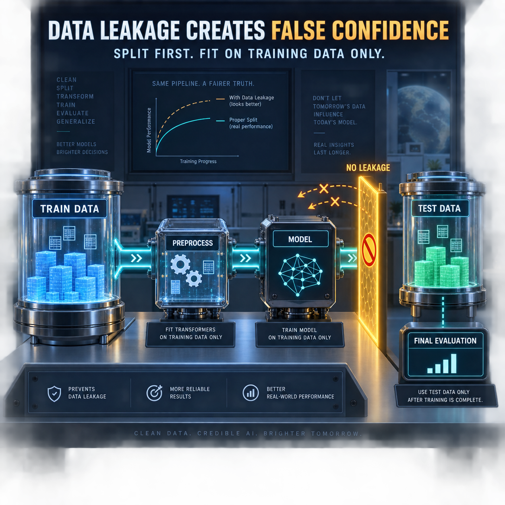

<!-- Origem: inventário do publicador Mac, 24/09/2026. Estado: prepared_unverified_schedule. -->
<!-- Para publicar: revalidar fonte, perfil e agendados; preservar C2PA da capa original. -->

The 2:00 AM data science package is ready as evergreen technical content because no material official news was identified for this slot.

**LinkedIn post**

A suspiciously high validation score may be evidence of a problem—not evidence of a great model.

Data leakage happens when information that would not be available at prediction time influences model training or evaluation.

The result is dangerous: the model appears accurate during development but performs poorly on genuinely unseen data.

One of the most common causes is preprocessing before splitting the dataset.

Consider this sequence:

1. Normalize the entire dataset.
2. Select features using all available examples.
3. Split the transformed data into training and test sets.
4. Report an excellent test score.

The test set has already influenced the transformation parameters and feature selection. It is no longer an independent evaluation.

A safer sequence is:

1. Split the data first.
2. Fit preprocessing only on the training set.
3. Apply the learned transformation to validation and test data.
4. Train the model using training data only.
5. Evaluate once against data that remained isolated.

In scikit-learn, a `Pipeline` helps preserve this boundary by fitting transformations within each training fold during cross-validation.

Time-dependent problems require another level of care. Random splitting can allow future observations to influence predictions about the past. Time-aware validation should preserve chronological order and may require a gap between training and evaluation periods.

Before trusting a model score, ask:

- Was every transformation fitted only on training data?
- Were features genuinely available at prediction time?
- Did duplicate entities appear across different splits?
- Does the validation strategy reflect how the model will operate in production?
- Is the test set still truly unseen?

A model does not generalize because its metric is impressive.

It generalizes when the evaluation reproduces reality.

What leakage check has saved one of your projects?

**Sources**

- [scikit-learn — Common pitfalls and recommended practices](https://scikit-learn.org/dev/common_pitfalls.html)
- [scikit-learn — Time-based cross-validation example](https://scikit-learn.org/stable/auto_examples/applications/plot_cyclical_feature_engineering.html)
- [Google for Developers — Monitoring production ML pipelines](https://developers.google.com/machine-learning/crash-course/production-ml-systems/monitoring)
- [Google for Developers — Rules of Machine Learning](https://developers.google.com/machine-learning/guides/rules-of-ml)

#DataScience #MachineLearning #MLOps #DataQuality #ModelValidation

**Original English image**

[Download the PNG image](/Users/leandrojacome/.codex/generated_images/01a0d034-582a-72a1-98df-2af1c7150aba/exec-5c2184e0-1ddb-437e-a46d-04bf40b8f6a3.png)

Nothing has been published. Explicit approval is required immediately before publishing this post and image to LinkedIn.

<heartbeat>
  <automation_id>calend-rio-editorial-linkedin</automation_id>
  <decision>NOTIFY</decision>
  <message>The 2:00 AM evergreen data science post and original English image are ready for review and explicit publishing approval.</message>
</heartbeat>
