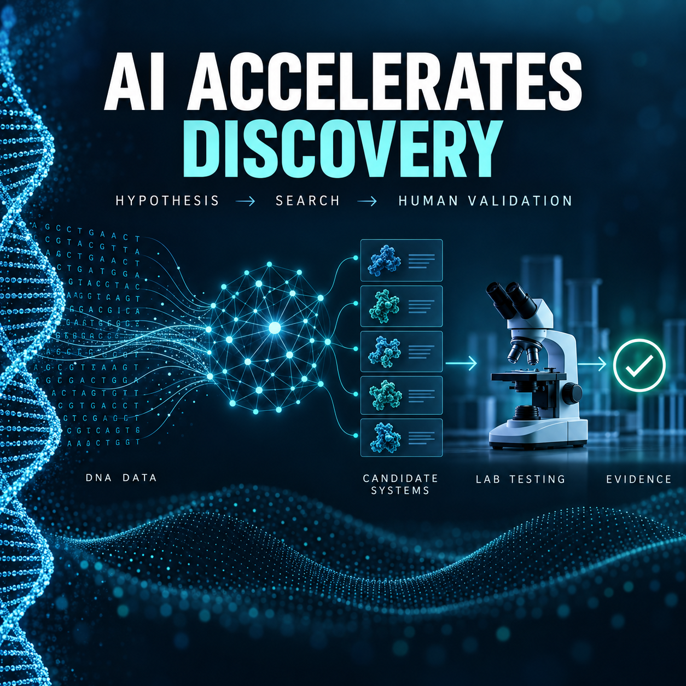

<!-- Origem: inventário do publicador Mac, 24/09/2026. Estado: prepared_unverified_schedule. -->
<!-- Para publicar: revalidar fonte, perfil e agendados; preservar C2PA da capa original. -->

The 08:00 AI editorial package is ready. The official update is dated September 23, but no publication time is shown, so I have not described it as conclusively published within the last 12 hours.

**LinkedIn post**

AI may be changing not only how scientists analyze data, but also how they decide which hypotheses deserve an experiment.

In a newly published research update, Anthropic describes how Claude agents searched large DNA-sequence databases for previously unknown biological systems.

The reported workflow used approximately:

• 950 AI agents  
• 210 million tokens  
• 21 hours of computational work  
• More than 200,000 reverse transcriptases analyzed  
• Around 3,500 candidate systems identified  
• 20 candidates selected for closer investigation  

The process highlighted an array-associated reverse transcriptase system containing CRISPR-like repeats. Human researchers then reviewed the findings and performed the laboratory validation.

That distinction matters.

AI accelerated the search and hypothesis-generation stages. Scientists still determined what to test, conducted the experiments, and interpreted the evidence.

The biological function of the system remains unknown, and the results are still early-stage research—not a finished medical or biotechnology application.

The broader lesson is compelling: the strongest scientific workflows may combine machine-scale exploration with human judgment and rigorous experimental validation.

Which scientific bottleneck do you think is most ready for this kind of human-AI collaboration?

Source: [Anthropic — Claude discovers a novel enzyme system with CRISPR-like repeats](https://www.anthropic.com/news/claude-discovers-novel-enzyme-system)

#ArtificialIntelligence #ScientificDiscovery #ComputationalBiology #LifeSciences #AIResearch

The original English image is complete, with its provenance information preserved. It has not been published. Explicit approval will still be required immediately before posting it on LinkedIn.

<heartbeat>
  <automation_id>calend-rio-editorial-linkedin</automation_id>
  <decision>NOTIFY</decision>
  <message>The 8:00 AM AI post and original English image are ready for review and explicit publishing approval.</message>
</heartbeat>
