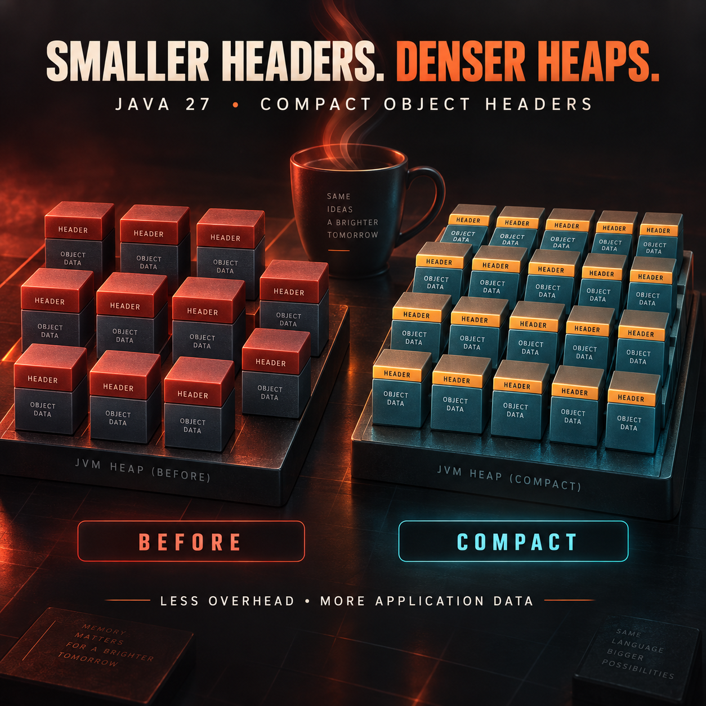

<!-- Origem: inventário do publicador Mac, 24/09/2026. Estado: prepared_unverified_schedule. -->
<!-- Para publicar: revalidar fonte, perfil e agendados; preservar C2PA da capa original. -->

No meaningful official Java announcement was found within the last 12 hours, so this package uses clearly labeled evergreen technical content based on Java 27’s current runtime improvements.

**LinkedIn post — Evergreen Java insight**

A Java object contains more than application data.

The JVM also stores metadata in every object header: information used for identity, locking, garbage collection, and runtime bookkeeping. Across a heap containing millions of objects, that overhead becomes significant.

Java 27 enables Compact Object Headers by default.

The practical idea is straightforward:

• Smaller headers reduce per-object overhead  
• More objects can fit within the same heap  
• Applications may put less pressure on memory and garbage collection  
• Large, object-heavy services can potentially achieve better deployment density  

But this is not a universal performance guarantee.

The real impact depends on the application’s object graph, allocation rate, heap configuration, garbage collector, and workload. Teams should measure representative production behavior instead of treating a lower memory footprint as an automatic latency improvement.

A sensible evaluation process is:

1. Capture a baseline using the current production JDK  
2. Upgrade and run realistic workloads  
3. Compare heap occupancy, allocation rate, GC pauses, throughput, and tail latency  
4. Validate libraries, monitoring agents, and operational tooling  
5. Roll out incrementally with clear rollback criteria  

Runtime improvements are valuable, but disciplined measurement is what turns them into reliable engineering outcomes.

How does your team evaluate JVM upgrades: synthetic benchmarks, production traffic replay, canary deployments—or a combination?

Sources: [Oracle’s Java 27 announcement](https://www.oracle.com/news/announcement/oracle-releases-java-27-and-strengthens-post-quantum-cryptography-support-2026-09-15/) · [JEP 534: Compact Object Headers](https://openjdk.org/jeps/534)

#Java #JVM #OpenJDK #SoftwareEngineering #ApplicationPerformance

The original Java-oriented English image is ready with provenance information preserved. Nothing has been published. Your explicit approval will be required immediately before posting it to LinkedIn.

<heartbeat>
  <automation_id>calend-rio-editorial-linkedin</automation_id>
  <decision>NOTIFY</decision>
  <message>The 10:00 AM evergreen Java post and original English image are ready for review and explicit publishing approval.</message>
</heartbeat>
