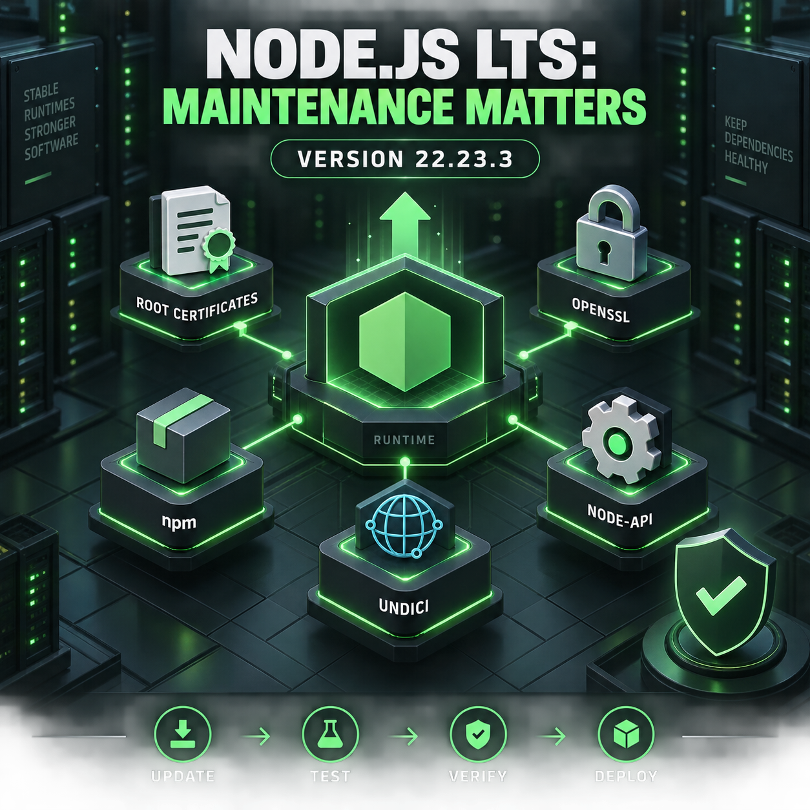

<!-- Origem: inventário do publicador Mac, 24/09/2026. Estado: prepared_unverified_schedule. -->
<!-- Para publicar: revalidar fonte, perfil e agendados; preservar C2PA da capa original. -->

The official Node.js project published version 22.23.3 LTS on September 23. Because the page does not expose an exact publication time, I cannot conclusively verify that it falls within the last 12 hours; the post describes it as a fresh official release without making that narrower claim.

**LinkedIn post**

Node.js 22.23.3 LTS is now available—and it is a useful reminder that maintenance releases deserve engineering attention.

This release updates several foundational components:

• Root certificates to NSS 3.125  
• OpenSSL to 3.5.8  
• npm to 10.9.9  
• Corepack to 0.36.0  
• Undici to 6.28.1  
• ICU to 78.3  
• Time-zone data to 2026c  

It also expands Node-API support for `SharedArrayBuffer`, including typed-array creation and external shared buffers.

None of this means teams should deploy blindly.

Runtime updates can affect certificate validation, networking behavior, native addons, package-management workflows, internationalization, and platform compatibility. A controlled adoption process remains essential:

1. Review the release notes and dependency changes  
2. Rebuild applications and native modules  
3. Run integration, TLS, HTTP, and package-installation tests  
4. Validate observability agents and deployment images  
5. Compare production-like behavior against the current runtime  
6. Deploy progressively with rollback criteria  

The most important runtime releases are not always the ones with headline features. Sometimes they are the releases that quietly keep certificates, cryptography, networking, tooling, and compatibility current.

Is your Node.js upgrade process automated—or does every maintenance release still become a manual project?

Source: [Node.js 22.23.3 LTS release notes](https://nodejs.org/en/blog/release/v22.23.3)

#NodeJS #npm #JavaScript #BackendDevelopment #SoftwareMaintenance

The original English image is ready with provenance information preserved. Nothing has been published. Your explicit approval will be required immediately before posting it to LinkedIn.

<heartbeat>
  <automation_id>calend-rio-editorial-linkedin</automation_id>
  <decision>NOTIFY</decision>
  <message>The 12:00 PM Node.js/npm post and original English image are ready for review and explicit publishing approval.</message>
</heartbeat>
