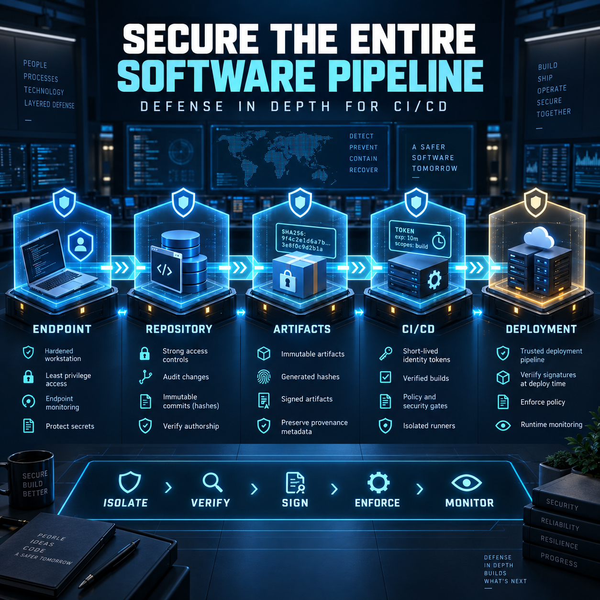

<!-- Origem: inventário do publicador Mac, 24/09/2026. Estado: prepared_unverified_schedule. -->
<!-- Para publicar: revalidar fonte, perfil e agendados; preservar C2PA da capa original. -->

Mandiant published fresh official guidance dated September 24. The page does not expose an exact publication time, so I cannot conclusively verify the narrower 12-hour window.

**LinkedIn post**

The software pipeline is becoming part of the attack surface—not merely the mechanism used to deliver fixes.

New guidance from Mandiant highlights how sophisticated threat actors are targeting trusted development tools and the engineering lifecycle itself.

Observed tactics include:

• Compromising security scanners, utility libraries, and AI development tools  
• Targeting developer workstations through social engineering, malicious extensions, and typosquatted dependencies  
• Stealing private keys, API tokens, and active sessions  
• Poisoning shared CI/CD caches  
• Extracting short-lived OIDC tokens  
• Exploiting mutable action tags to distribute compromised packages with apparently legitimate provenance  

The defensive response must cover the complete delivery path:

1. **Endpoints:** harden workstations, restrict extensions, scan for secrets, and isolate risky development activity.

2. **Repositories:** enforce phishing-resistant MFA, protected branches, peer review, immutable history, and short-lived credentials.

3. **Artifacts:** quarantine new dependencies, use internal proxies, verify provenance, generate signed SBOMs, and reference images by digest.

4. **CI/CD:** use ephemeral runners, isolate caches, minimize permissions, replace persistent secrets with federated identities, and prevent untrusted pull requests from reaching privileged environments.

5. **Deployment:** verify signatures at admission, enforce policy as code, eliminate unnecessary privileges, and continuously monitor runtime behavior.

One control is not enough. A scanner cannot compensate for an exposed token, and a signed artifact cannot help if the deployment process never verifies the signature.

Secure software delivery requires continuous verification from the developer endpoint to the production workload.

Which layer of your delivery pipeline currently receives the least security attention?

Source: [Mandiant — Proactive Defense: Hardening Code Pipelines and CI/CD Infrastructure](https://cloud.google.com/blog/topics/threat-intelligence/hardening-code-pipelines-and-ci-cd-infrastructure)

#Cybersecurity #DevSecOps #SoftwareSupplyChain #CICD #CloudSecurity

The original English image is ready with provenance information preserved. Nothing has been published. Your explicit approval will be required immediately before posting it to LinkedIn.

<heartbeat>
  <automation_id>calend-rio-editorial-linkedin</automation_id>
  <decision>NOTIFY</decision>
  <message>The 4:00 PM cybersecurity post and original English image are ready for review and explicit publishing approval.</message>
</heartbeat>
