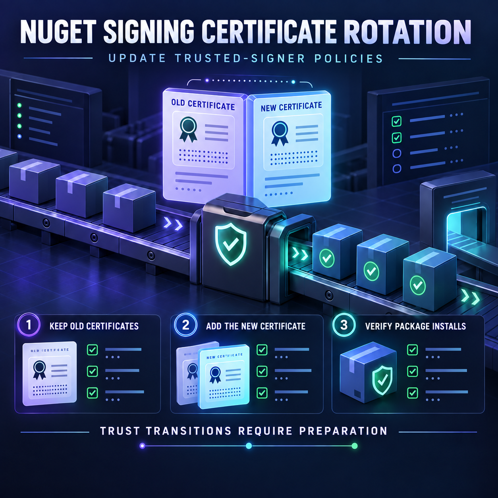

<!-- Origem: inventário do publicador Mac, 24/09/2026. Estado: prepared_unverified_schedule. -->
<!-- Para publicar: revalidar fonte, perfil e agendados; preservar C2PA da capa original. -->

Microsoft published an official NuGet certificate-transition notice dated September 23. The page does not expose an exact publication time, so I cannot conclusively verify that it falls within the last 12 hours.

**LinkedIn post**

Microsoft is rotating the author-signing certificate used for its NuGet packages—and some .NET build environments require immediate preparation.

The new certificate can now become the default signer for newly published Microsoft packages. Packages already signed with older certificates will retain their existing signatures.

Most developers should see no change. The affected environments are primarily those that:

• Enforce a NuGet trusted-signers allowlist  
• Pin Microsoft’s signing-certificate fingerprints in `nuget.config`  
• Use `dotnet nuget verify` with an explicit set of accepted fingerprints  

If the new certificate is missing from a trusted-signers policy, installation of newly signed packages can fail with error `NU3034`.

The recommended transition is additive:

1. Keep the existing Microsoft certificates trusted  
2. Add the new certificate fingerprint from Microsoft’s official notice  
3. Update the correct `nuget.config` scope  
4. Update package-verification commands  
5. Test restores and installations in CI before the change reaches production pipelines  

Removing the older certificates prematurely can break verification of packages that were signed before the rotation.

This is a useful reminder that supply-chain controls require lifecycle management. A strict trust policy is only effective when certificate rotations, expirations, and overlapping validation periods are handled deliberately.

Does your CI pipeline test trusted-signer policy changes before they reach every development environment?

Source: [Microsoft .NET Blog — Author-signing certificate update](https://devblogs.microsoft.com/dotnet/microsoft-author-signing-certificate-update-2026/)

#DotNet #NuGet #SoftwareSupplyChain #DevSecOps #PackageSecurity

The corrected original English image is ready. Invented certificate details were removed, and its provenance information remains preserved. Nothing has been published. Your explicit approval will be required immediately before posting it to LinkedIn.

<heartbeat>
  <automation_id>calend-rio-editorial-linkedin</automation_id>
  <decision>NOTIFY</decision>
  <message>The 6:00 PM .NET and NuGet post and corrected English image are ready for review and explicit publishing approval.</message>
</heartbeat>
