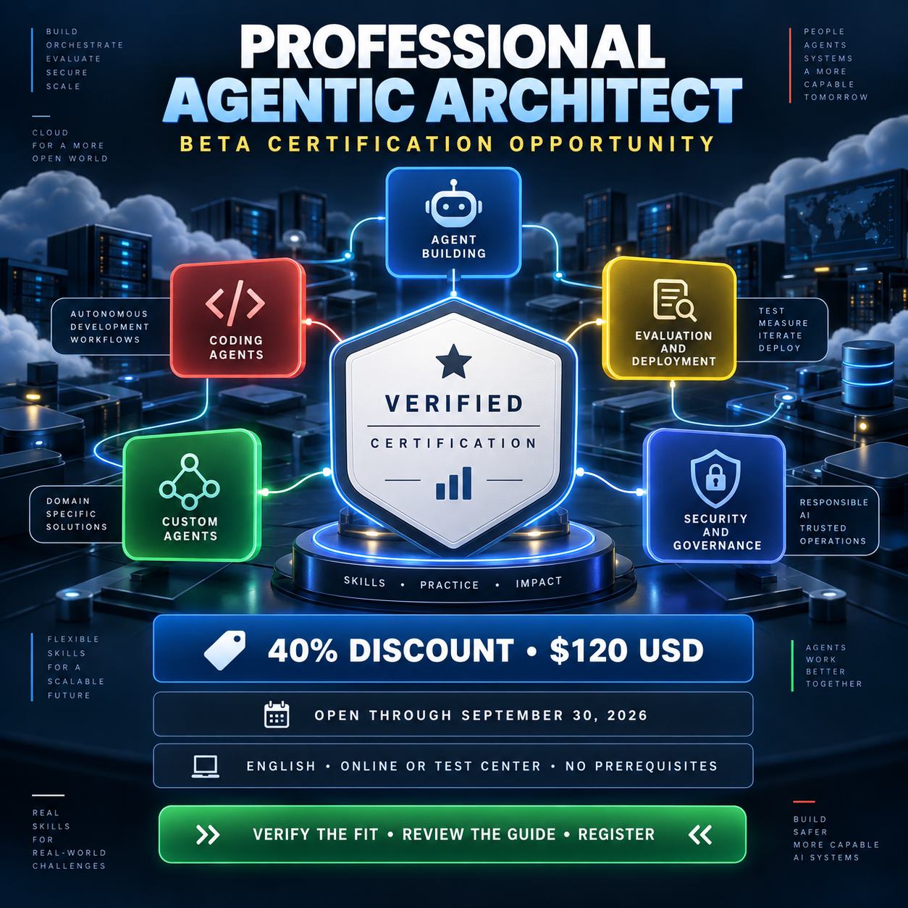

<!-- Origem: inventário do publicador Mac, 24/09/2026. Estado: published_confirmed. -->
<!-- Para publicar: revalidar fonte, perfil e agendados; preservar C2PA da capa original. -->

The opportunity was verified as active on Google Cloud’s official certification pages on September 24, 2026.

**LinkedIn post**

A time-sensitive certification opportunity is currently available for professionals working with AI agents and cloud architecture.

Google Cloud’s **Professional Agentic Architect beta certification** is open through **September 30, 2026**.

Verified offer details:

• Beta registration fee: **$120 USD**, plus applicable taxes  
• Standard retail price: **$200 USD**  
• Discount: **40%**  
• Language: **English**  
• Delivery: Online-proctored or at a testing center  
• Prerequisites: **None**  
• Multiple-choice exam: Approximately 80 questions in three hours  
• Beta certification validity: One year  

The certification assesses five primary capability areas:

1. Building agents with low-code tools  
2. Using coding agents for application development  
3. Developing custom agents  
4. Evaluating and deploying agentic workflows  
5. Securing and governing agentic workflows  

This is not a beginner-level exam despite having no formal prerequisite. Google recommends at least three years of hands-on experience building, testing, deploying, and managing cloud solutions—including one year working with agentic solutions on Google Cloud.

The certification also uses a two-part validation model: a proctored conceptual exam followed by hands-on labs for candidates who pass the multiple-choice component.

Because this is a beta, results are expected four to six weeks after both the exam and lab windows close. Beta attempts do not count toward the normal limit on exam attempts, and vouchers are accepted.

Before registering, review the exam guide carefully and confirm that your practical experience matches the assessed domains.

Official sources: [Professional Agentic Architect certification](https://cloud.google.com/learn/certification/agentic-architect) · [Google Cloud certification catalog](https://cloud.google.com/learn/certification)

#GoogleCloud #CloudCertification #AgenticAI #CloudArchitecture #ProfessionalDevelopment

The original English image is ready with provenance information preserved. Nothing has been published. Your explicit approval will be required immediately before posting it to LinkedIn.

<heartbeat>
  <automation_id>calend-rio-editorial-linkedin</automation_id>
  <decision>NOTIFY</decision>
  <message>The verified 8:00 PM discounted-certification post and original English image are ready for review and explicit publishing approval.</message>
</heartbeat>
